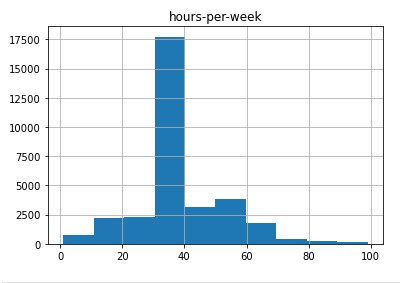
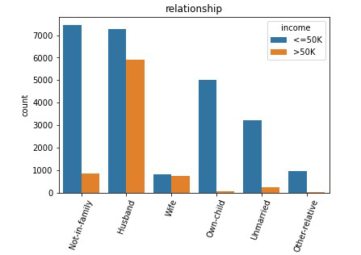

# Income Range Prediction using ML Classification Model

#### In this project, I used Adult Census Income Dataset From Kaggle and built a classification model to predict income ranges based upon several factors.


## About Dataset

This data was extracted from the 1994 Census bureau database by Ronny Kohavi and Barry Becker (Data Mining and Visualization, Silicon Graphics). A set of reasonably clean records was extracted using the following conditions: ((AAGE>16) && (AGI>100) && (AFNLWGT>1) && (HRSWK>0)).

#### The prediction task is to determine whether a person makes over $50K a year.

## MetaData
The dataset has 15 features and 32K rows.


## Project Objective

The Purpose of this project is to be able to predict income ranges based on several features, Explore how further education and othe aspects could make a difference in the adults income, And to 
know the type of people who makes the highest income.


## Methods Used

In this project I used a variety of datascience techniques like :

- Feature Engineering

- Data Visualization

- Exploratory Data Analysis

- Hypothesis Testing

- Predictive Modeling

- Machine Learning(Classification)
## Technologies


- Python

- Jupyter Notebook

- Pandas Library

- Numpy Library

- Matplotlip Library

- Seaborn Library

- Sklearn Machine Learning Library
## Imports

```python
import pandas as pd 
import numpy as np 
import matplotlib.pyplot as plt 
import seaborn as sns 


```
## Visualizations







